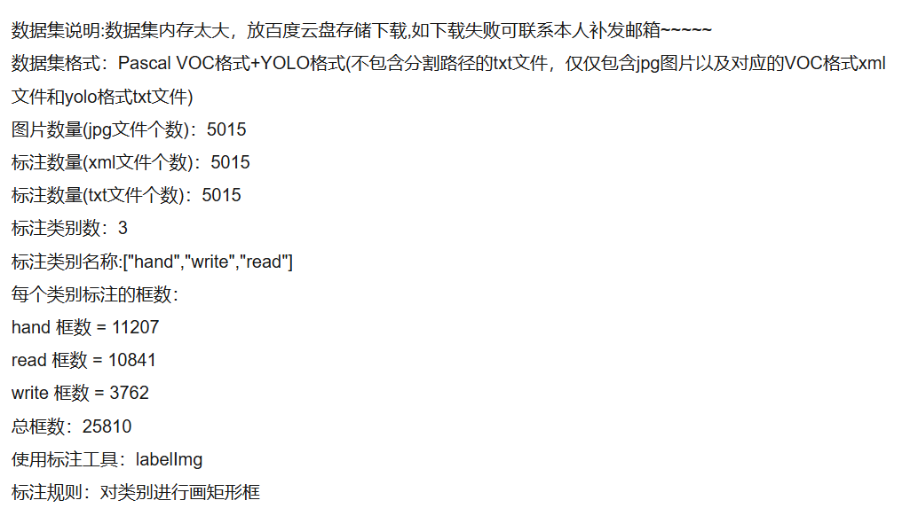
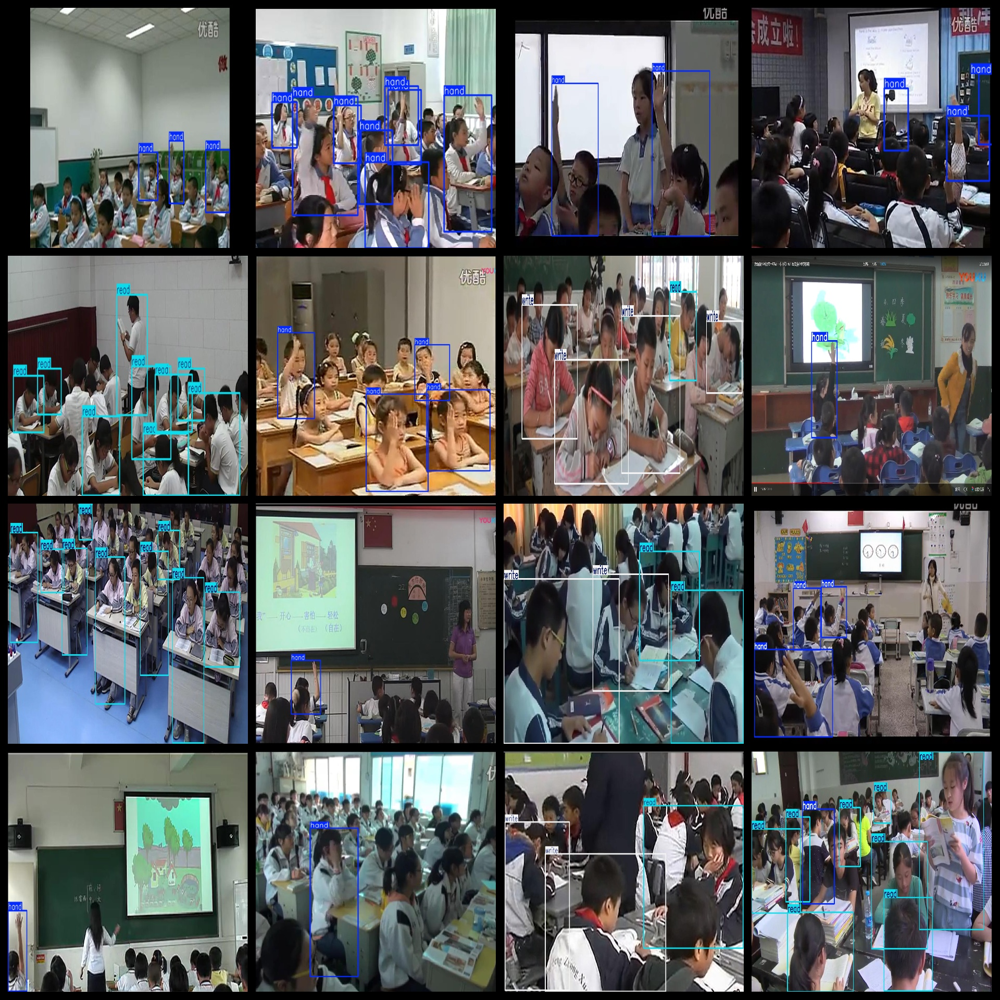

# [Object Detection Dataset] Classroom Hand-Raising Hand Reading and Writing Dataset VOYOLO format5015 images3-class

Dataset Description: ~

Dataset format: Pascal VOC format + YOLO format (the txt file does not contain the split path, it only contains jpg images and corresponding VOC format xml files and yolo format txt files)

Number of images (number of jpg files): 5015

Number of annotations (number of xml files): 5015

Number of annotations (number of txt files): 5015

Number of annotated categories: 3

Annotation class names: ["hand","write","read"]

Number of boxes labeled in each category:

hand frame count = 11207

read frame count = 10841

write frame count = 3762

Total boxes: 25810

Use the labeling tool: labelImg

Rules for annotation: Draw a rectangle around the category.

Annotation examples or image overview:

## Images

---

Here is a pay link on Stripe (https://buy.stripe.com/3cs8yP7sY87d0vu9AB). Please contact me lonlonago@foxmail.com after funding $89, and I will send you a complete data files, thank you!

